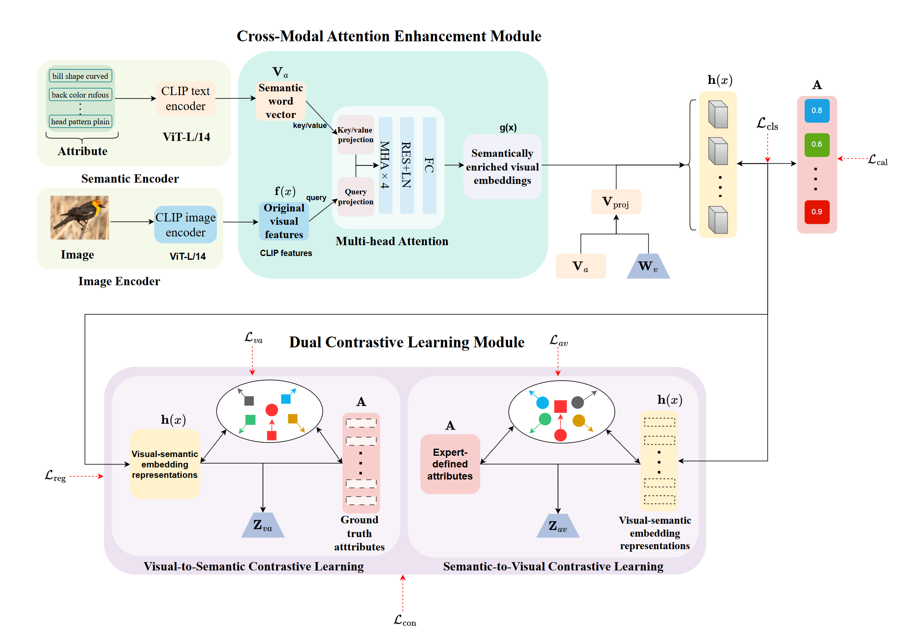

# DVIE

   This repository contains the reference code for the paper "**DVSIE: Dual Visual-Semantic Interaction Enhancement for Generalized Zero-Shot Learning**".

   


## 🌈 Model Architecture




## 📚 Dependencies

- ```Python 3.8```
- ```PyTorch = 1.8.0```
- All experiments are performed with one RTX 4090 GPU.

# ⚡ Prerequisites

- **Dataset**: please download the dataset, i.e., [CUB](http://www.vision.caltech.edu/visipedia/CUB-200-2011.html), [AWA2](https://cvml.ist.ac.at/AwA2/), [SUN](https://groups.csail.mit.edu/vision/SUN/hierarchy.html) to the dataset root path on your machine
- **Data split**: Datasets can be download from [Xian et al. (CVPR2017)](https://datasets.d2.mpi-inf.mpg.de/xian/xlsa17.zip) and take them into dir ```../../datasets/```.
- Download pretranined vision Transformer as the vision encoder.

## 🚀 Train & Eval

Before running commands, you can set the hyperparameters in config on different datasets: 

```
config/DVIE_cub_gzsl.yaml       #CUB
config/DVIE_sun_gzsl.yaml      #SUN
config/DVIE_awa2_gzsl.yaml    #AWA2
```

Train:

```shell
 python train_DVIE_cub.py
 python train_DVIE_sun.py
 python train_DVIE_AWA2.py
```


##  Contact
If you have any questions about codes, please don't hesitate to contact us by wangman395@gmail.com.


